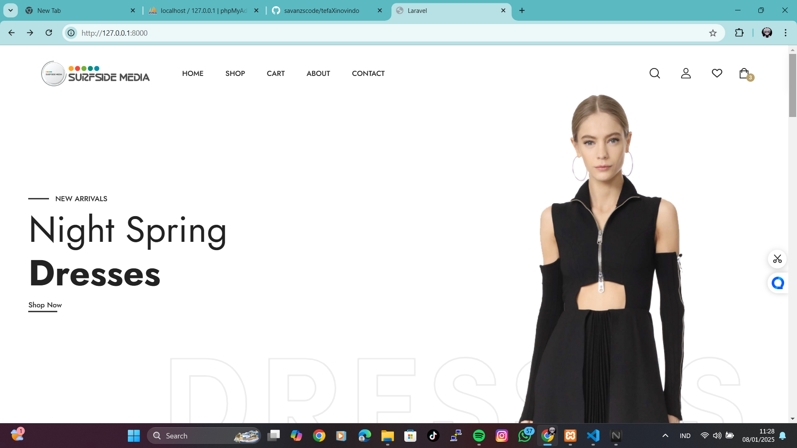
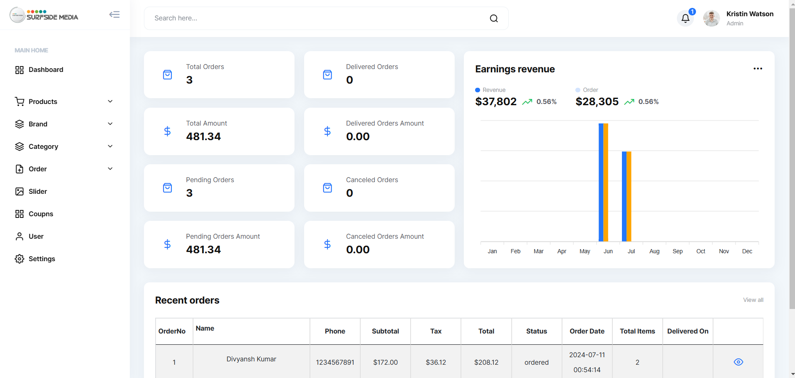

# E-Commerce Application

## Introduction

This is a fully functional e-commerce application designed to provide users with a seamless shopping experience. The application includes essential features such as user authentication, product browsing, cart management, order processing, and payment integration.

## Features

### User Features:

-   **User Authentication:** Secure login and registration system.
-   **Product Browsing:** Browse products by category, price, and popularity.
-   **Search Functionality:** Search products using keywords.
-   **Shopping Cart:** Add, update, and remove items from the cart.
-   **Wishlist:** Save favorite items for future purchases.
-   **Order History:** View past orders and their statuses.

### Admin Features:

-   **Product Management:** Add, update, or delete products.
-   **Order Management:** Manage and process customer orders.
-   **User Management:** View and manage user profiles.
-   **Reports:** Generate sales and inventory reports.

### Additional Features:

-   **Responsive Design:** Optimized for both desktop and mobile devices.
-   **Payment Gateway:** Secure integration with popular payment gateways.
-   **Notifications:** Email and SMS notifications for orders and updates.
-   **Discounts and Coupons:** Apply discount codes at checkout.

## Technologies Used

### Frontend:

-   **HTML5**
-   **CSS3**
-   **Bootstrap**
-   **JavaScript**
-   **Vue.js** (optional for dynamic interactions)

### Backend:

-   **PHP (Laravel Framework)**
-   **MySQL** (Database)
-   **RESTful APIs**

### Third-Party Integrations:

-   **Payment Gateway API** (e.g., Stripe, PayPal)
-   **Cloud Storage** (e.g., AWS S3 for images)
-   **Notification Services** (e.g., Twilio for SMS, SendGrid for email)

## Installation

1. Clone the repository:
    ```bash
    git clone https://github.com/savanzscode/tefaXinovindo.git
    ```
2. Navigate to the project directory:
    ```bash
    cd ecommerce-app
    ```
3. Install dependencies:
    ```bash
    composer install
    npm install
    ```
4. Configure the environment variables:
    - Copy `.env.example` to `.env`.
    - Update database credentials and API keys in the `.env` file.
    ```bash
    php artisan key:generate
    ```
5. Run migrations and seed the database:
    ```bash
    php artisan migrate --seed
    ```
6. Start the development server:
    ```bash
    php artisan serve
    npm run dev
    ```
7. Access the application in your browser:
    ```
    http://localhost:8000
    ```

## Usage

-   Register as a user and start browsing products.
-   Admins can log in through the `/admin` route to manage the system.

## Future Enhancements

-   **AI Recommendations:** Personalized product recommendations based on user behavior.
-   **Multi-Language Support:** Localized content for different regions.
-   **Progressive Web App (PWA):** Enable offline browsing and app-like experience.

## Contributors

-   **savanzscode** - Developer
-   **berman0** - backend
-   **adimasaputra** - frontend
-   **oacley** - frontend
-   Open for contributions. Please submit a pull request.

## License

This project is licensed under the MIT License. See the `LICENSE` file for details.

## Screenshots




